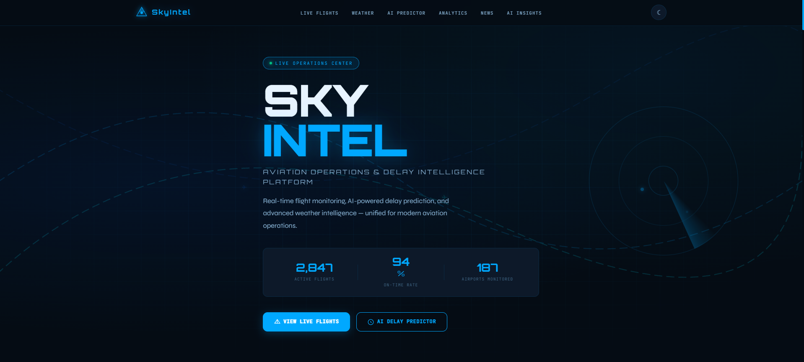
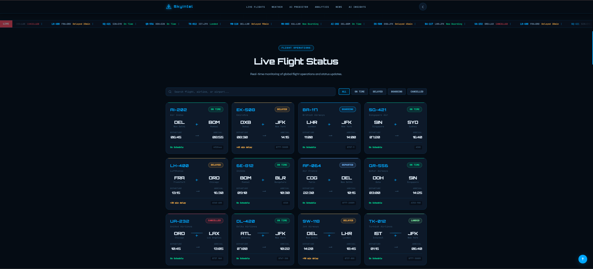
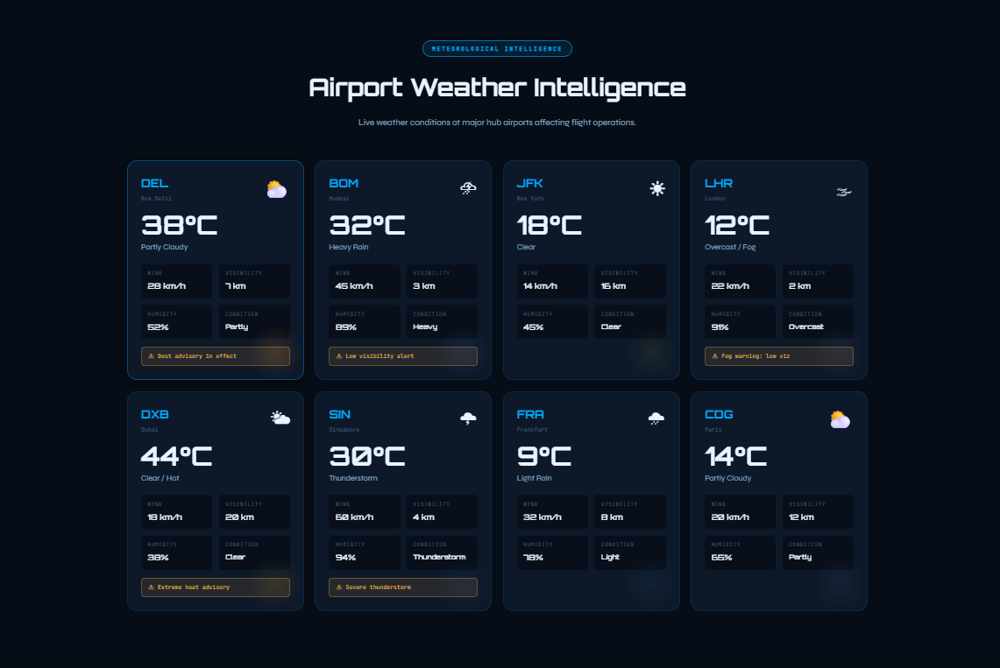
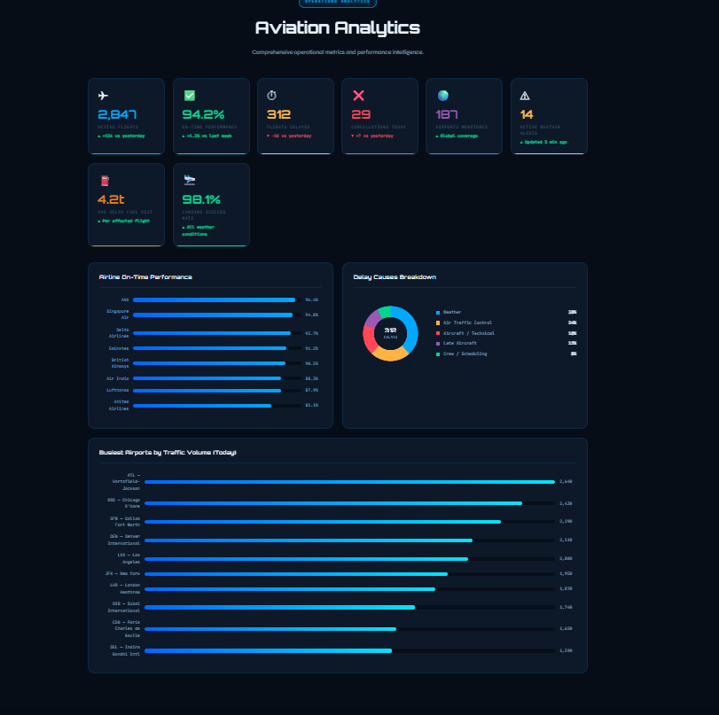
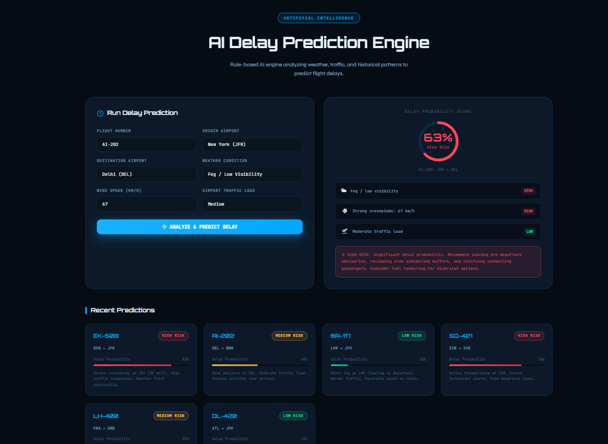
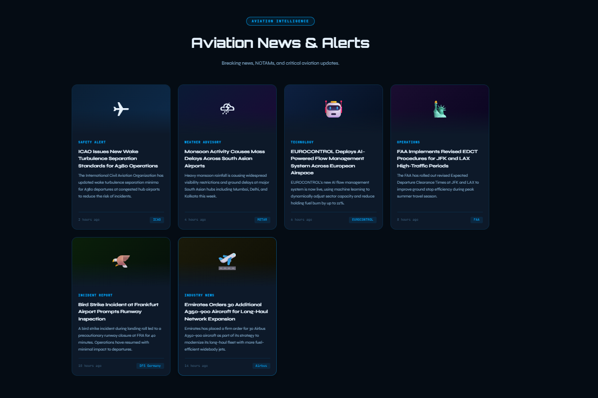
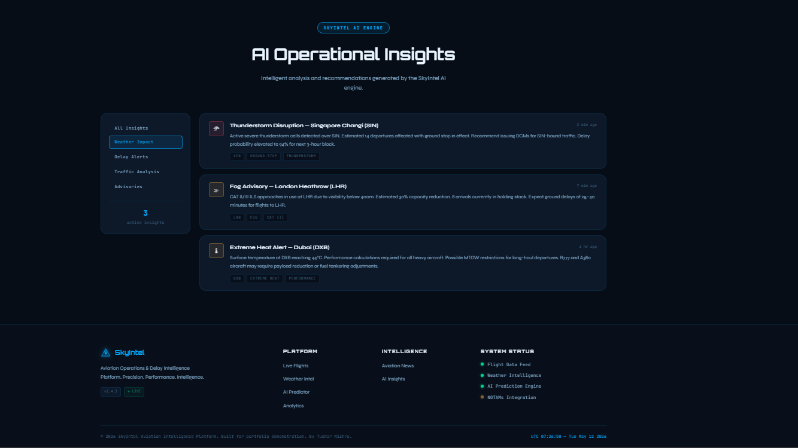

<div align="center">

<h1> SkyIntel Aviation Dashboard</h1>

<h3><i>Next-generation aviation intelligence. Engineered for clarity at 35,000 feet.</i></h3>

<p>A futuristic aviation operations dashboard delivering real-time flight data, AI-powered delay prediction,<br/>weather intelligence, and operational insights — built entirely on the modern web stack.</p>

<br/>

<a href="https://tusharr-mishra.github.io/skyintel-aviation-dashboard/">
  
</a>
&nbsp;
<a href="https://github.com/tusharr-mishra/skyintel-aviation-dashboard">
  
</a>

<br/><br/>

</div>

---

<div align="center">



<sub> SkyIntel Operations Center — Main Dashboard View</sub>

</div>

---

<div align="center">

<h2>🎥 Live Product Walkthrough</h2>

<p>
A full walkthrough of all core modules — flight monitoring, AI predictions, weather feeds, analytics, and the responsive dark/light UI system.
</p>

<p>
<a href="https://drive.google.com/file/d/1KJxxNPjQA-I-82b3xK2Hv1NHuR01WlPU/view?usp=sharing">
  
</a>
</p>

<p>
<b>▶ <a href="https://drive.google.com/file/d/1KJxxNPjQA-I-82b3xK2Hv1NHuR01WlPU/view?usp=sharing">Watch Full Demo</a></b>
</p>

</div>

---

<div align="center">

<h2> About the Platform</h2>

</div>

**SkyIntel** is a frontend-engineered aviation intelligence platform designed to simulate the operational command layer of a modern airline or airport management system.

Built without frameworks or dependencies, it demonstrates mastery of **vanilla web engineering** — from dynamic DOM rendering and real-time UI state management to glassmorphic design systems and AI-augmented interface logic.

> *Think of it as a mission control interface for the modern aviation era — where data clarity meets aerospace-grade precision.*

The platform surfaces six intelligence modules in a unified dashboard: live flight operations, layered weather data, AI-generated delay risk analysis, operational KPI analytics, news and alert feeds, and actionable AI operational insights.

---

<div align="center">

<h2> Feature Matrix</h2>

</div>

| Module | Description | Status |
|---|---|---|
| ✈ **Live Flight Monitoring** | Real-time flight cards with status, route, gate, and delay data | `Operational` |
| 🌦 **Weather Intelligence** | Airport-level weather feeds — visibility, wind, pressure, alerts | `Operational` |
| 🤖 **AI Delay Prediction** | Predictive delay scoring with confidence levels and risk factors | `Operational` |
| 📊 **Analytics Dashboard** | KPI counters, route performance, and operational trend charts | `Operational` |
| 💡 **AI Operational Insights** | Context-aware AI recommendations for ground ops and scheduling | `Operational` |
| 📰 **Aviation News System** | Curated aviation news ticker and live alert panels | `Operational` |
| 🎨 **Light / Dark Mode** | Persistent theme toggle with `localStorage` state management | `Operational` |
| 📱 **Responsive Design** | Fluid layouts optimized across mobile, tablet, and desktop | `Operational` |
| 🔍 **Dynamic Filtering** | Interactive multi-parameter flight and route filtering system | `Operational` |
| ✨ **Smooth Animations** | Glassmorphism UI, animated counters, scroll-triggered reveals | `Operational` |

---

<div align="center">

<h2> Technology Stack</h2>

| Layer | Technology | Purpose |
|---|---|---|
| **Structure** |  | Semantic document architecture |
| **Styling** |  | Glassmorphism design system, animations, responsive grid |
| **Logic** |  | DOM engine, state management, rendering pipeline |
| **UI Pattern** | `Glassmorphism` | Frosted-glass card system with depth and blur |
| **Theme Engine** | `localStorage API` | Persistent user preference — survives page reloads |
| **Scroll Engine** | `Intersection Observer API` | Performant scroll-triggered reveal animations |
| **Layout** | `CSS Grid + Flexbox` | Adaptive, fluid multi-column layouts |

</div>

---

<div align="center">

<h2> Platform Screenshots</h2>

<h4>Flight Operations Center</h4>



<sub>Live flight cards with real-time status indicators, route data, and delay flags</sub>

<br/><br/>

| | |
|:---:|:---:|
| <br/><sub><b>Weather Intelligence</b> — Per-airport atmospheric data feeds</sub> | <br/><sub><b>Analytics Dashboard</b> — Animated KPI counters and performance metrics</sub> |
| <br/><sub><b>AI Delay Prediction</b> — Confidence-scored predictive risk engine</sub> | <br/><sub><b>Aviation News & Alerts</b> — Live ticker bar and NOTAM-style alert panel</sub> |

<br/>

<h4>AI Operational Insights</h4>



<sub>Context-aware AI suggestions for ground operations, scheduling, and resource management</sub>

</div>

---

<div align="center">

<h2> Frontend Architecture</h2>

</div>

SkyIntel's architecture is deliberately modular — each intelligence panel operates as an independent rendering unit within a shared design system.

```
SkyIntel/
├── index.html           ← Semantic shell & module scaffolding
├── style.css            ← Design system: tokens, themes, animations
├── script.js            ← Rendering engine, state logic, event bus
│
└── assets/
    ├── screenshots/     ← Module previews
    └── demo/            ← Platform walkthrough video
```

<details>
<summary><b> Design System Overview</b></summary>

<br/>

| Layer | Approach |
|---|---|
| **Color Tokens** | CSS custom properties for full light/dark theme switching |
| **Typography Scale** | Modular type scale with aviation-tuned hierarchy |
| **Glassmorphism Cards** | `backdrop-filter`, layered `rgba`, controlled `blur` |
| **Motion System** | CSS keyframes + JS-driven Intersection Observer triggers |
| **Responsive Grid** | CSS Grid with fluid breakpoints — mobile-first architecture |

</details>

<details>
<summary><b>◈ JavaScript Architecture</b></summary>

<br/>

| Pattern | Implementation |
|---|---|
| **Dynamic Rendering** | All flight cards, weather panels, and insights rendered via JS — zero hardcoded HTML |
| **State Management** | Lightweight theme + filter state via `localStorage` and module-scoped variables |
| **Event Bus** | Centralized listener registration for filters, toggles, and scroll triggers |
| **Reusable Components** | Card, badge, and panel generators as pure JS factory functions |
| **Performance** | `Intersection Observer` replaces scroll event listeners for animation triggers |

</details>

---

<div align="center">

<h2>◈ Key Frontend Engineering Concepts</h2>

</div>

- **DOM Manipulation** — Full programmatic rendering of dynamic UI components without a framework
- **Filtering Logic** — Multi-parameter, real-time filter pipeline applied across datasets
- **localStorage Persistence** — Theme state survives sessions; preference-aware on load
- **Intersection Observer API** — Scroll-triggered animations with zero scroll listener overhead
- **Dynamic Rendering** — All data modules rendered at runtime from structured JS data objects
- **Event Architecture** — Delegated event listeners with clean separation of concerns
- **Responsive Layouts** — CSS Grid and Flexbox in tandem for fluid, adaptive intelligence panels
- **Animated Counters** — Eased, frame-accurate counter animations tied to scroll visibility
- **Ticker System** — CSS + JS-driven live news ticker with seamless loop logic

---

<div align="center">

<h2>◈ Installation & Launch</h2>

</div>

No build tools. No dependencies. Pure web — ready to fly in seconds.

```bash
# Clone the repository
git clone https://github.com/tusharr-mishra/skyintel-aviation-dashboard.git

# Navigate into the project
cd skyintel-aviation-dashboard

# Launch in your browser
open index.html
```

> On Windows: `start index.html` &nbsp;·&nbsp; On Linux: `xdg-open index.html`

---

<div align="center">

<h2>◈ Roadmap & Future Development</h2>

</div>

| Priority | Enhancement | Notes |
|---|---|---|
| 🔴 High | **Live Aviation API Integration** | FlightAware, OpenSky Network, AviationStack |
| 🔴 High | **Real-Time Weather Feeds** | METAR / TAF via Aviation Weather Center API |
| 🟡 Medium | **Backend Infrastructure** | Node.js + Express REST layer for data aggregation |
| 🟡 Medium | **React Migration** | Component-driven architecture with hooks-based state |
| 🟢 Planned | **Database Connectivity** | PostgreSQL for historical flight and delay datasets |
| 🟢 Planned | **Authentication System** | Role-based access for operations staff and analysts |
| 🟢 Planned | **WebSocket Integration** | True real-time data push without polling overhead |

---

<br/>

<div align="center">

<p><b>SkyIntel Aviation Dashboard &nbsp;·&nbsp; Engineered for the modern web</b></p>

<p><i>Cleared for takeoff. Destination: production.</i></p>

<br/>

<p>Built with precision by <a href="https://github.com/tusharr-mishra"><b>Tushar Mishra</b></a></p>

<br/>


&nbsp;

&nbsp;


<br/><br/>

<sub><i>Radar contact established. Squawk 7700 only if you don't ship clean code.</i></sub>

</div>
